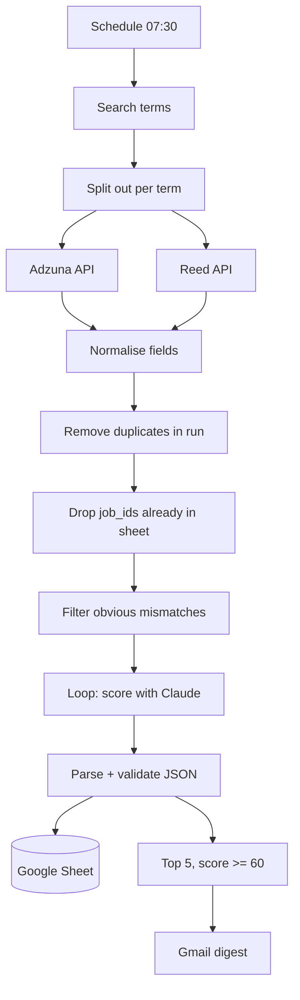
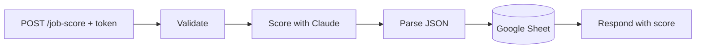
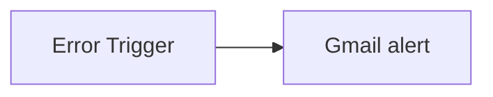

# Architecture

_Draft — updated as the workflows are built._

## Workflow A: Daily Job Scan

```mermaid
flowchart TD
    S[Schedule 07:30] --> T[Search terms] --> SO[Split out per term]
    SO --> AZ[Adzuna API] & RD[Reed API]
    AZ & RD --> N[Normalise fields]
    N --> D1[Remove duplicates in run]
    D1 --> D2[Drop job_ids already in sheet]
    D2 --> F[Filter obvious mismatches]
    F --> L[Loop: score with Claude]
    L --> P[Parse + validate JSON]
    P --> GS[(Google Sheet)]
    P --> TOP[Top 5, score >= 60] --> GM[Gmail digest]
```

## Workflow B: Manual Job Webhook

```mermaid
flowchart LR
    W[POST /job-score + token] --> V[Validate] --> C[Score with Claude] --> P[Parse JSON] --> GS[(Google Sheet)] --> R[Respond with score]
```

## Workflow C: Error Alerts

```mermaid
flowchart LR
    E[Error Trigger] --> G[Gmail alert]
```
